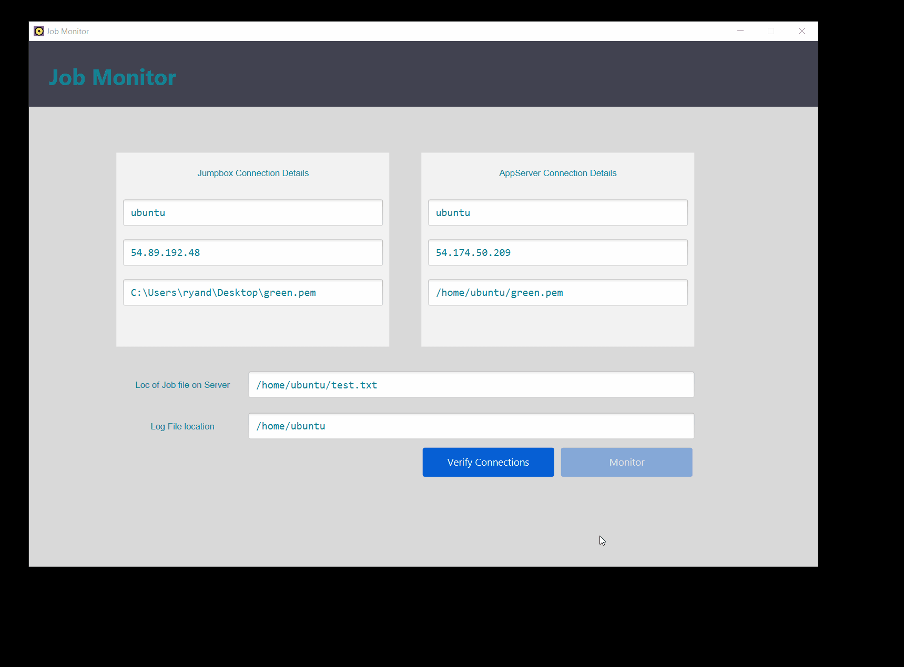

# Job Monitor
This is a simple JavaFX application that monitors jobs running in an AWS EC2 instance and reports their statuses. There are 2 EC2 instances here:

- First one is a jump box which is connected from the application using SSH
- Second one is an App Server, which can only be connected from the Jump box, again using SSH.

A Scheduler is already running on the App server (It is not part of this application). From time to time, it monitors a set of jobs and writes their status to a log file. This app reads the status file and show their state.

This application executes a Thread in the background to monitor the jobs and updates their status.

****

### Screen shots

****

